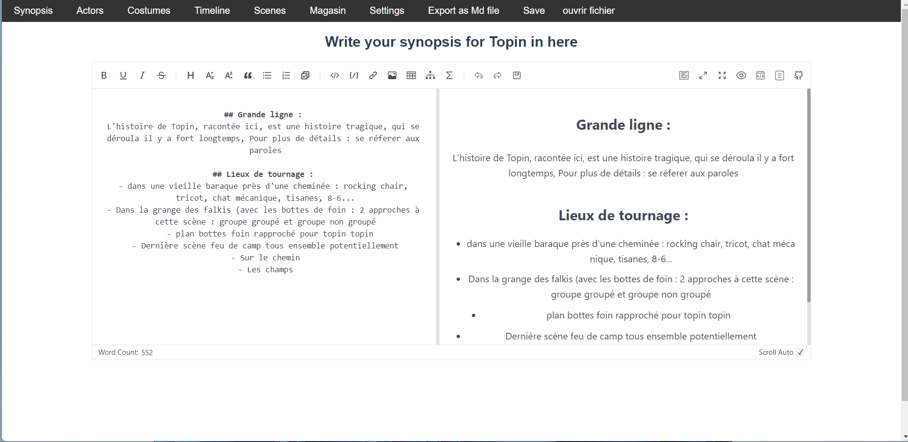

# Video Music Script Generator

This application is a GUI for creating video music scripts with ease. It helps users plan everything they need to do for their video music projects. Once everything has been planned within the app, scripts can be exported as Markdown or PDF for easy printing.

The application is built using Vue.js and Electron, with all data stored directly in the frontend for simplicity and ease of use.

Here's a screenshot of the application's first page :



## Usage

Open the application.
Plan your video music script using the intuitive GUI.
Once you're done planning, export your script as a Markdown or PDF file.
Print your exported script and start creating your video music project!
We hope this application makes the process of creating video music scripts easier and more enjoyable. Happy planning!


## Project Setup

First, you need to install the necessary dependencies:

```bash
npm install
``` 

Then, you can just launch or build the project using npm run electron:serve or electron:build.


